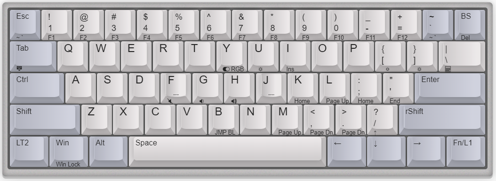
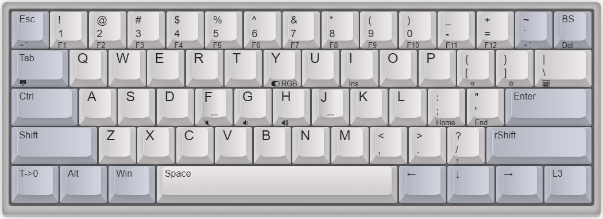

# xd60_finally

自己的 xd60 键盘配置固件，使用ydkb_tool工具刷入

配列说明：

- 分裂了 BackSpace，添加 1u “~” 键 1u “BackSpace”
- 将 CapsLock 配置为 Ctrl
- 配置右侧 Ctrl 为 FN 在 0 层瞬间切换底1层松开后恢复0层，实现多媒体和方向键up，del等功能
- 配置左侧 Ctrl 双击切换至第二层，在第二层将右侧 Ctrl 配置为瞬间切换第三层，实现1层实的功能，单机左侧 Ctrl 后跳转回0层

